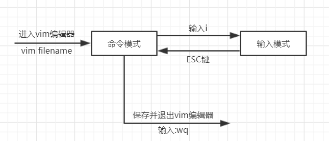

#  vim

vim可用于查看、编辑、新增文件。vim可以分为两种模式，即命令模式（还有底线命令模式）和输入模式。

Window中的编辑器，如Vs code，命令操作和输入操作是分开的。在编辑区敲击键盘可以编辑文件，在工具栏点击相应按钮可以执行命令，如查找、替换。但对于Linux中的vim编辑器，所有想要做的事情都是只能通过敲击键盘来完成，没有可视化的操作界面。所有在vim中使用模式的概念是非常有必要的。敲击同样的键盘，在不同的模式有不同的含义效果。如在命令模式下敲击键盘输入/hello，表示在文件中查找hello，而在输入模式，却表示在文件中输入/hello。

命令模式只有一些最基本的命令，因此仍要依靠底线命令模式输入更多命令，命令模式下，`:` 切换到底线命令模式，以在最底一行输入命令

输入模式就没有什么好讲的了，在键盘上敲击什么键就输入什么内容。有常用以下按键

按键 | 作用
:-- | :--
字符按键以及Shift组合 | 输入字符
enter | 回车键，换行
backspace | 退格键，删除光标前一个字符
delete | 删除键，删除光标后一个字符
方向键 | 在文本中移动光标
home/end | 移动光标到行首/行尾
Page Up/Page Down | 上/下翻页
ESC | 退出输入模式，切换到命令模式

命令模式下有哪些常用的命令？
按键 | 作用
:-- | :--
i | 进入输入模式
G | 光标移动到文件的最后一行
/hello | 在文件中查找hello
n | 将光标定位到下一个找到的hello上
N | 将光标定位到上一个找到的hello上
:w | 保存
:q | 退出vim编辑器
:q! | 若修改过文件，有不想储存，使用 ! 为强制离开不储存文件
:wq | 保存并退出
:set nu | 设置行号
:set nu | 取消行号

