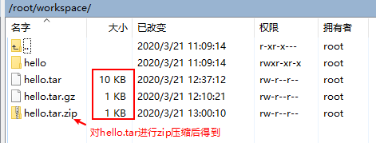

# tar

tar命令既可以用于打包，也可以用于解打包

## 1 打包

> 可以对**目录或者文件**进行打包

用法：`tar [选项] 源文件或目录`

常用选项：

- `-c` 将多个文件或目录进行打包
- `-v` 显示打包文件过程
- `-f 包名` 指定打包后的文件名。包的扩展名是用来给管理员识别格式的，所以一定要正确指定扩展名

例子：

初始目录结构：

```
/root
|- /workspace
   |- /hello
      |- hello.txt
```

`tar -cvf hello.tar hello` shell命令进入workspace目录，将目录hello打包成单个文件，打包后的文件名叫hello.tar，位于workspace目录下

## 2 解打包

用法：`tar [选项] 压缩包`

常用选项：

- `-x` 对 tar 包做解打包操作
- `-v` 显示解打包的具体过程
- `-f` 指定要解压的 tar 包的包名

例子：

`tar -xvf hello.tar` 解打包到当前目录下，再当前目录下多出一个hello目录

## 3 打包压缩

> 打包压缩操作可以理解为**先打包再压缩**，所有跟上述打包操纵一样，需要可选项`-cvf`，额外加`-z`表示压缩

用法：`tar [选项] 压缩包 源文件或目录`

常用选项：

- `-z` 压缩“.tar.gz”格式
- `-g` 压缩“.tar.bz2”格式

例子：

`tar -zcvf hello.tar.gz hello` 把hello目录直接打包压缩为".tar.gz"格式，通过"-z"来识别格式，"-cvf"和打包选项一致

## 4 解压缩解打包

> 解压缩解打包可以理解成包含解压缩、解打包两个操作，所以跟上述解打包操作一样，需要可选项`-xvf`，额外加`-z`表示解压缩

用法：`tar [选项] 压缩包`

常用选项：

- `-z` 解压缩“.tar.gz”格式
- `-g` 解压缩“.tar.bz2”格式

例子：

`tar -zxvf hello.tar.gz` 解压缩与解打包".tar.gz"格式

## 5 重点

常用可选项的区别：

可选项 | 含义
:-- | :--
`-vf` | 上面4个操作最好加上这两个可选项
`-c` | 表示打包
`-x` | 表示解打包
`-z`、`-j` | 跟压缩包相关的操作要加这个参数


因为Linux中文件扩展名仅仅用于给用户识别文件类型、用处，因此在打包、打包压缩操作时需要指定打包或打包压缩后的文件名。

对比hello.tar.gz和hello.tar，可以发现，打包压缩比单纯打包可以大幅减少最终的体积大小。通过hello.tar.zip和hello.tar.gz，可以发现，打包压缩操作其实就是先打包再进行压缩。



