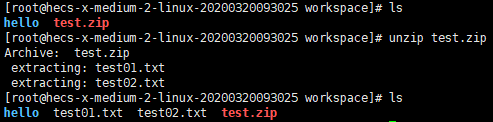

# zip和unzip

# 1 zip

用法：`zip [选项] 压缩包名 源文件或源目录列表`

- `-r` 递归压缩目录

例子：

`zip hello.tar.zip hello.tar` 压缩文件hello.tar

`zip hello01.tar.zip hello` 递归压缩目录

`zip test.zip test01.txt test02.txt` 同时压缩多个文件

# 2 unzip

用法：`unzip [选项] 压缩包名`

- `-d 目录名` 将压缩文件解压到指定目录下

解压上述产生的压缩包test.zip

