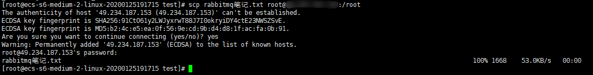

# 文件传输

文件传输在平时开发中很常见，如将本地Windows文件上传到Linux主机、Linux堡垒机向另外一台Linux主机传输文件

## 本地Windows文件上传到Linux主机

这里使用rz

[Xshell 怎么上传文件到Linux](https://jingyan.baidu.com/article/3052f5a13c1ebf97f31f862b.html)

如果Linux主机目标目录下已经存在同名文件，则会传输失败。解决办法是在Windows修改要传输的文件的名称，或在Linux主机修改同名文件的名称。

##  Linux之间复制文件和目录

`scp test.txt username@xxx.xxx.xxx.xxx:/home/username` 表示将当前主机中的test.txt文件上传到主机xxx.xxx.xxx.xxx的/home/username目录下

