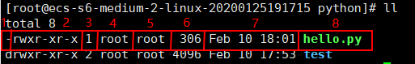

# 文件基本属性



每部分含义：

1. 文件类型
2. 文件属性，包含3段，每三个字符为一段。第一段表示文件创建者/所有者对该文件所具有的权限，第二段表示创建者/所有者所在的组的其他用户所具有的权限，第三段表示其他组的其他用户所具有的权限
3. 目录/链接个数
4. 文件的所有者
5. 文件的所属组
6. 文件大小
7. 修改日期
8. 文件名称

## 1 修改文件的所有者 chown

用法：`chown [option] user[:group] file...`

将文件 file1.txt 的所有者设为test，组设为testgroup↓

```sh
chown test:testroup file1.txt
```

## 2 修改文件的所属组 chgrp

用法：`chown [option] group file...`

## 3 修改文件的属性 chmod

用法：`chmod [option] mode 文件或目录`

mode有两种方式，一种是数字、一种是符号

### 3.1 数字方式

mode：是一个三位数的数字

每种权限的值：

权限|r|w|x
:--|:--|:--|:--
值|4|2|1

每种范围(owner/group/others)各自的三个权限(r/w/x)分数是需要累加的，例如当权限为： [-rwxrwx---] 分数则是：

- owner = rwx = 4+2+1 = 7
- group = rwx = 4+2+1 = 7
- others= --- = 0+0+0 = 0

```sh
[root@ecs-s6-medium-2-linux-20200125191715 python]# ll hello.py
-rwxr-xr-x 1 root root 306 Feb 10 18:01 hello.py
[root@ecs-s6-medium-2-linux-20200125191715 python]# chmod 770 hello.py
[root@ecs-s6-medium-2-linux-20200125191715 python]# ll hello.py
-rwxrwx--- 1 root root 306 Feb 10 18:01 hello.py
```

### 3.2 符号方式（推荐）

mode：[ugoa][+-=][rwe]

范围|操作|权限
:--|:--|:--
u<br>g<br>o<br>a | +(加入)<br>-(除去)<br>o(设定) | r<br>w<br>x

注意如果没有明确给出范围，则默认使用a

对hello.py文件其他用户加入可执行权限↓

```sh
[root@ecs-s6-medium-2-linux-20200125191715 python]# ll hello.py
-rwxrwx--- 1 root root 306 Feb 10 18:01 hello.py
[root@ecs-s6-medium-2-linux-20200125191715 python]# chmod o+x hello.py
[root@ecs-s6-medium-2-linux-20200125191715 python]# ll hello.py
-rwxrwx--x 1 root root 306 Feb 10 18:01 hello.py
```

所在组其他用户除去可写权限，其他用户加入可写权限↓

```sh
[root@ecs-s6-medium-2-linux-20200125191715 python]# ll hello.py
-rwxrwx--x 1 root root 306 Feb 10 18:01 hello.py
[root@ecs-s6-medium-2-linux-20200125191715 python]# chmod g-w,o+w hello.py
[root@ecs-s6-medium-2-linux-20200125191715 python]# ll hello.py
-rwxr-x-wx 1 root root 306 Feb 10 18:01 hello.py
```

同时修改多个权限↓

```sh
[root@ecs-s6-medium-2-linux-20200125191715 python]# ll hello.py
-rwxr-x-wx 1 root root 306 Feb 10 18:01 hello.py
[root@ecs-s6-medium-2-linux-20200125191715 python]# chmod u=rwx,g=rw,o=- hello.py
[root@ecs-s6-medium-2-linux-20200125191715 python]# ll hello.py
-rwxrw---- 1 root root 306 Feb 10 18:01 hello.py
```

`chmod +x hello.py`等价与`chmod a+x hello.py`，一般用于使脚本拒用执行权限↓

```sh
[root@ecs-s6-medium-2-linux-20200125191715 python]# ll hello.py
-rwxrw---- 1 root root 306 Feb 10 18:01 hello.py
[root@ecs-s6-medium-2-linux-20200125191715 python]# chmod +x hello.py
[root@ecs-s6-medium-2-linux-20200125191715 python]# ll hello.py
-rwxrwx--x 1 root root 306 Feb 10 18:01 hello.py
```

