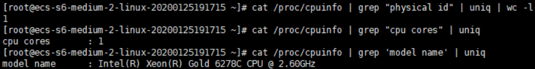

# 查看系统信息cpu、内存等

[Linux下查看CPU型号,内存大小,硬盘空间的命令(详解)](https://blog.csdn.net/qq_37960324/article/details/82704576)

## 1 CPU

- `cat /proc/cpuinfo | grep "physical id" | uniq | wc -l` 查看CPU个数。uniq命令：删除重复行;wc –l命令：统计行数

- `cat /proc/cpuinfo | grep "cpu cores" | uniq` 查看CPU核数

- `cat /proc/cpuinfo | grep 'model name' | uniq` 查看CPU型号

总结：1个1核CPU，型号Intel(R) Xeon(R) Gold 6278C CPU @ 2.60GHz

## 2 内存

- `cat /proc/meminfo | grep MemTotal` 查看总的内存大小

## 3 电脑和操作系统的相关信息

[uname命令](https://www.jianshu.com/p/e7d8f5a650f1)