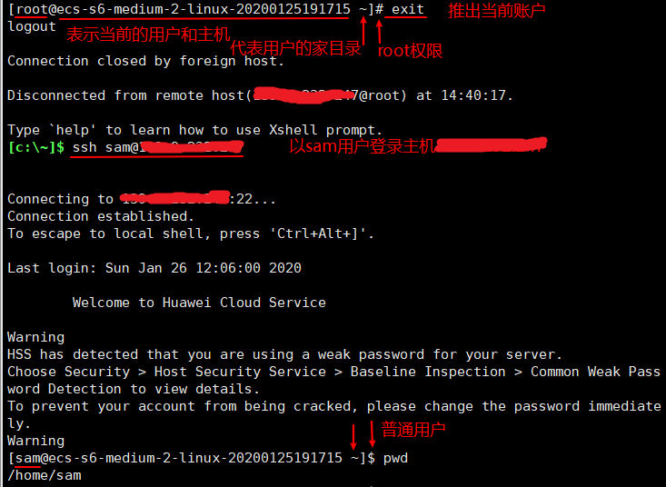
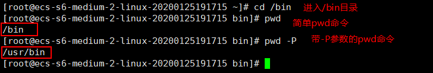
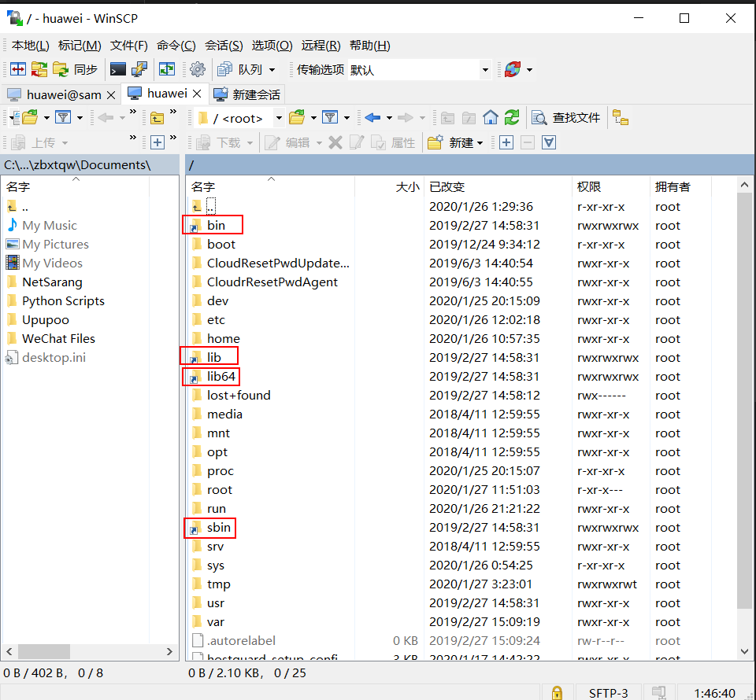

# 用户



`]`右侧的`#`、`$`用于区分用户：

- `#` 表示root用户
- `$` 表示普通用户

`]`左侧的`~`、`/`用于区分当前所在目录：

- `~` 表示当前用户的家目录，root用户为/root，一般用户则为/home/username，使用pwd显示目前的目录
- `/` 表示根目录

pwd 是 Print Working Directory 的缩写，也就是显示目前所在目录的命令。

`[root@www ~]# pwd [-P]`

选项与参数：

- 显示出确实的路径，而非使用连结 (link) 路径。





在WinSCP中带图标的目录表示连结 (link) 路径，如/bin目录实际指向/usr/bin目录，即在更目录下放一个常用目录的快捷引用目录。

## 1 登录主机

`ssh sam@主机ip`

## 2 切换用户

`su [-] username 【username是你的用户名哦】`

从root用户切换到非root用户，无需输入密码，执行完命令即切换成功。从非root用户切换到其他用户，提示需要输入密码。

'-'，表示切换用户后直接进入到该用户的家目录（也叫主目录），否则进入切换之前所在目录。注意，'-' 和su、username之间都要有空格。

即：

```sh
su - username
```

等价于

```sh
su username
cd ~
```

## 3 对用户的管理

对用户的管理其实是对/etc/passwd文件的操作，每个用户在/ect/passwd文件中对应一行，该文件对所有用户可读，如：

```
root:x:0:0:root:/root:/bin/bash
...
sam:x:1000:1000:测试:/home/sam:/bin/bash
```

每行记录被`:`分隔成7个字段，其格式和含义如下：

用户名:口令:用户标识号:组标识号:注释性描述:主目录:登录Shell

查看用户信息：

```sh
[root@ecs-s6-medium-2-linux-20200125191715 ~]# getent passwd sam
sam:x:1000:1000:测试:/home/sam:/bin/bash
```

具体操作参考[Linux useradd 命令介绍](https://linux.cn/article-11756-1.html)、[Linux 用户和用户组管理](https://www.runoob.com/linux/linux-user-manage.html)

## 4 对口令（密码）的管理

对口令（密码）的管理其实是对/ect/shadow文件的操作，该文件中的记录行与/etc/passwd中的一一对应，如：

```
root:$6$vSVpm/RcohLozEo2$2nHL.vNdYptaoqMkVEg0/qC6IAO6nGEjbm9A0YC04xuc31QkRfRO1rWpYJL3jBW69Z4SyPZwmdBf1kiCScwT50:18286:0:99999:7:::
...
sam:$6$N.kgRVKB$S/xCm.rUH8BBGWIpuFMR1l/q6zL7BU1v3dYnZ.bA0nJIGC8L2s7iWJQ8IjEcd20Ntb50jUgK8qMLQ6nvfBBWo.:18287:0:99999:7:::
```

由若干个字段组成，字段之间用":"隔开，格式和含义如下：

登录名:加密口令:最后一次修改时间:最小时间间隔:最大时间间隔:警告时间:不活动时间:失效时间:标志

最后一次修改时间是相对1970年1月1日的天数，其他几个时间单位为天

## 5 对组的管理

对组的管理其实是对/ect/group文件的操作，用户跟组是多对多的关系，如：

```
root:x:0:
sam:x:1000:
```

结构和含义如下：

组名:口令:组标识号:组内用户列表
