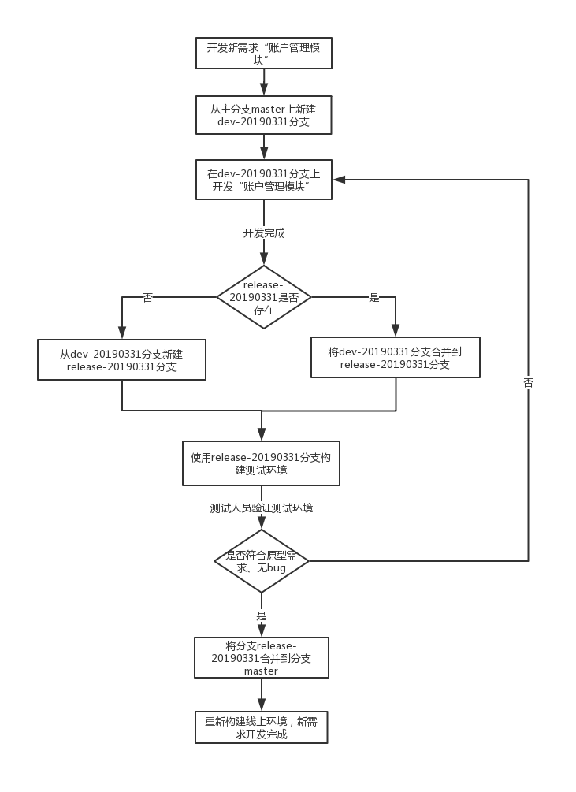
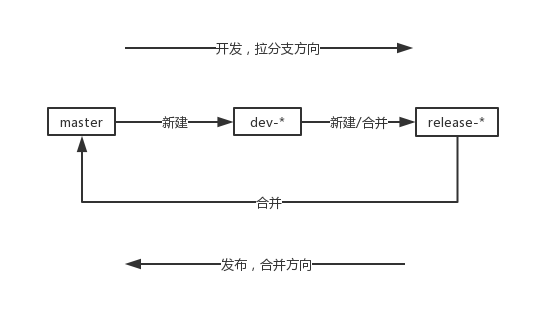

# git 分支管理策略

## 一、主分支master

代码库应该有且只有一个主分支。所有提供给用户使用的正式版本，都在这个主分支上发布。

Git主分支的名字，默认叫做`master`。它是自动建立的，版本库初始化以后，默认就是在主分支上进行开发。

## 二、开发分支dev-*

`master`分支是最稳定、最安全的分支，是现网环境运行的代码分支，一般不能直接在该分支上编写代码（万一改出问题那就麻烦了）。

日常开发应该在另一条分支上完成，我们把开发用的分支，叫做`dev-*`。

```bash
# 创建dev-20190331分支
git checkout -b dev-20190331 master
```

## 三、预发布分支release-*

当`dev-*`分支上的功能任务开发完，需要测试人员测试时，此时从`dev-*`上新建对应`release-*`分支，用于构建测试环境使用的git分支，通过测试后，将`release-*`分支合并到`master`分支。

```bash
#创建release-20190331分支
git checkout -b release-21090331 dev-20190331
```

```bash
# 切换到master分支
git checkout master

# 对release-20190331分支进行合并
git merge --no-ff release-20190331
```

## 四、重点

1 以开发新功能为例，讲解git流程

- 现在需要开发一个新功能，如添加一个“账户管理模块”，且该功能评估完成时间是2019年3月31号，从`master`分支新建分支`dev-20190331`；
- 当“账户管理模块”开发完成后，从`dev-20190331`分支上新建`release-20190331`分支用于构建测试环境（分支名称必须跟dev-20190331对应，表示该release分支是用于测试对应dev分支）；
- 测试过程可能会发现“账户管理模块”未达到原型需求或者有bug，此时应在`dev-20190331`分支上修改代码，然后合并到`release-20190331`分支 → 重新构建测试环境 → 再测试验证。直至开发的“账户管理模块”符合原型需求且没有bug，确认没问题后，合并到master分支；
- 发版master分支；




2 随着项目不断的开发，`dev-*`和`release-*`分支会越来越多，应该定期清理（注意，在删除分支之前应该确保该分支作用已经完成）

3 开发某种特定功能、新需求、优化，分支方向是：


