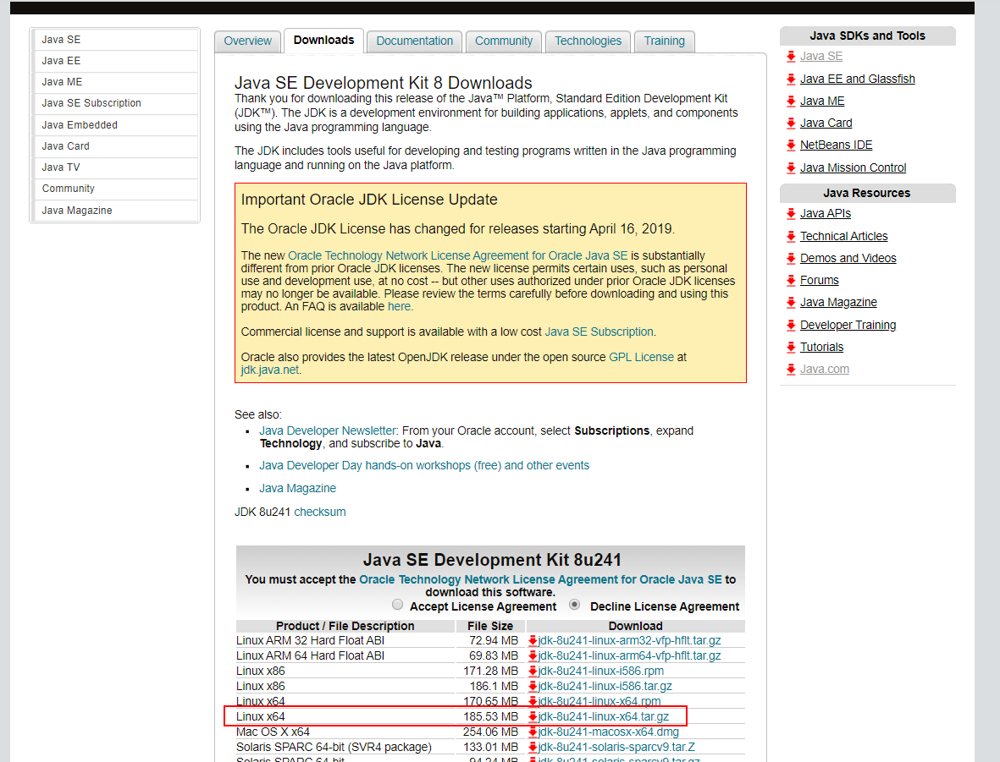
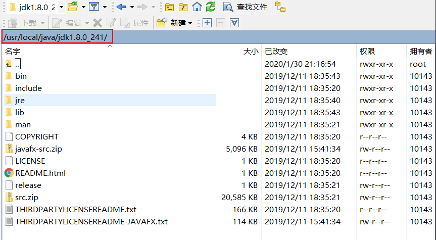

# Centos安装Java8

## 1 下载linux版本的jdk1.8

打开Oracle的jdk8的[下载页面](https://www.oracle.com/technetwork/java/javase/downloads/jdk8-downloads-2133151.html)，点击接受协议，然后下载64位版本的后缀名是.tar.gz格式的jdk。



## 2 查找系统是否已安装过Java

结合下面的两条命令：

`rpm -qa | grep java`

`find / -name "java*"`

## 3 将下载的.tar.gz格式的jdk通过WinSCP上传到Linu主机的/root/download目录中

/root/download目录时自己建的，用于存放下载的文件、压缩包等

## 4 在usr/local下面新建一个java目录

`mkdir /usr/local/java`

## 5 解压jdk压缩包

在放置jdk压缩包的目录（/root/download）下解压jdk压缩包，解压完成后当前目录下多了一个jdk1.8.0_241目录，将该目录移动到usr/local/java目录下

解压：

`tar -zxvf jdk-8u241-linux-x64.tar.gz`

移动，也可以通过WinSCP完成：

`mv jdk1.8.0_201/ /usr/local/java/`



## 6 添加环境变量

`vim /etc/profile`

安装shift+g跳转到文件末尾。加入以下配置。JAVA_HOME就是我们的jdk的路径

```sh
export JAVA_HOME=/usr/local/java/jdk1.8.0_241
export CLASSPATH=.:$JAVA_HOME/jre/lib/rt.jar:$JAVA_HOME/lib/dt.jar:$JAVA_HOME/lib/tools.jar
export PATH=$JAVA_HOME/bin:$PATH
```

保存并退出。执行命令 source /etc/profile使配置文件生效。然后输入 java -version，javac验证是否安装成功。
