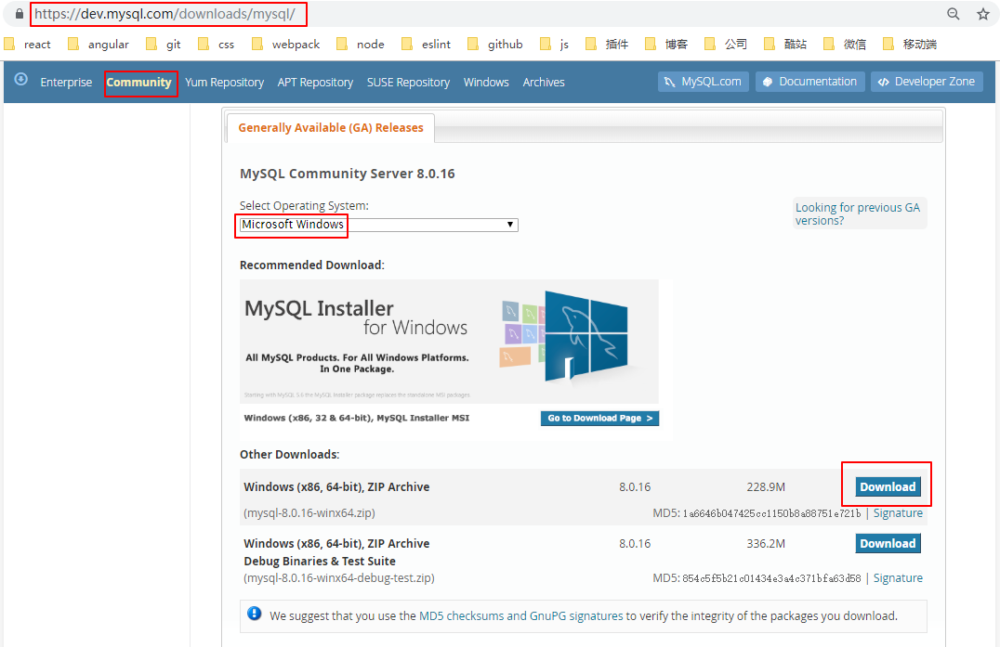
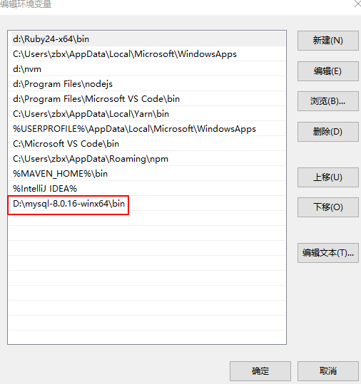
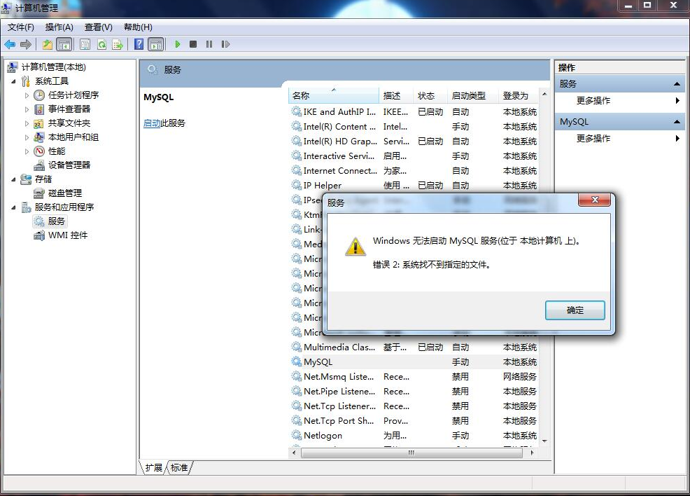
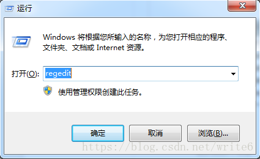
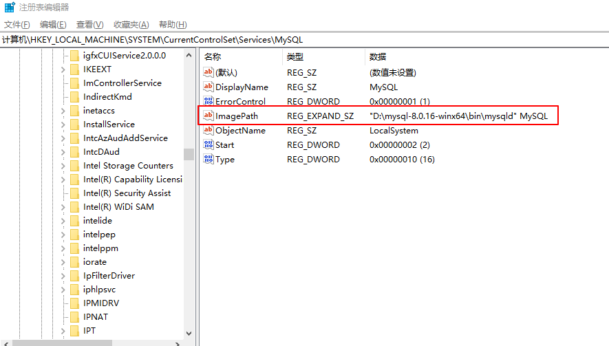
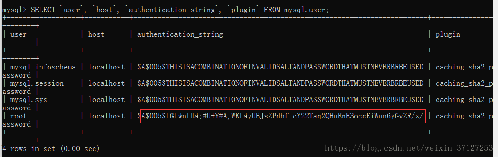
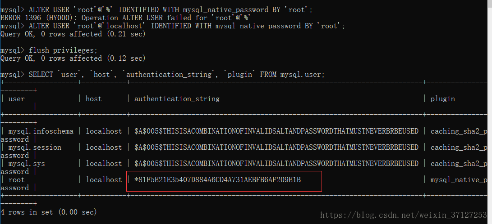

# eladmin 后台环境搭建

- MySql数据库
- MySql图形化操作工具Navicat
- Java开发编辑器Idea
- 后台依赖包管理工具Maven
- JDK环境
- eladmin项目使用到的Redis

## MySql

### 1 安装

- 下载window社区版本



下载的zip版解压后就可以使用，免安装，解压后的文件放在D:\mysql-8.0.16-winx64。添加MySql环境变量，编辑用户变量下的path



- 在D:\mysql-8.0.16-winx64下创建my.ini配置文件，配置如下：

  ```ini
  [mysql]
  # 设置mysql客户端默认字符集
  default-character-set=utf8

  [mysqld]
  # 设置3306端口
  port = 3306
  # 设置mysql的安装目录
  basedir = D:\mysql-8.0.16-winx64
  # 设置 mysql数据库的数据的存放目录
  datadir = D:\mysql-8.0.16-winx64\data
  ```

  注意目录的位置，版本号要和安装的MySql的安装地址和版本匹配，否则报错

- 初始化数据库：`mysqld --initialize --console`

- 执行完成后，会在MySql安装目录下生成数据的存放目录data，并且输出 root 用户的初始默认密码，如：

  ```
  ...
  2018-04-20T02:35:05.464644Z 5 [Note] [MY-010454] [Server] A temporary password is generated for root@localhost: APWCY5ws&hjQ
  ...
  ```

  APWCY5ws&hjQ 就是初始密码，后续登录需要用到，你也可以在登陆后修改密码。

- 输入以下安装命令：`mysqld install`，注意执行此命令需要管理员权限。

- 启动输入以下命令即可：`net start mysql`，这一步等同于在电脑-管理-服务和应用程序-服务中启动MySql服务一样

- 在命令行中登录 MySQL：`mysql -u root -p`（表示使用密码来登录root用户） 然后输入密码即可

- 退出登录：输入exit后回车

- 注意：在登录MySql前需求先启动MySql服务

- 初次登录后修改密码: `ALTER USER USER() IDENTIFIED BY '123456';`

### 2 问题

1 提示“Can't connect to MySQL server on 'localhost' (10061)”
错误原因：可能是MySql服务没启动。
解决方法：启动下mysql的服务， 电脑-管理-服务和应用程序-服务，找到mysql启动即可。



启动服务时可能会提示“Windows 无法启动MySql服务 （位于 本地计算机上）错误2： 系统找不到指定的文件”

错误原因：服务的路径与安装的路径不一致，之前安装过mysql后卸载重装容易出现这样的问题

解决方法：
修改windows注册表，windows+r  在运行对话框输入regedit，点击确定，进入注册表编辑器。选择HKEY_LOCAL_MACHINE ->SYSTEM -> CurrentControlSet -> services ->MySQL，修改ImagePath的路径为Mysql安装路径，例如："D:\mysql-5.7.19-winx64\bin\mysqld" MySQL





2 初次登录数据库后，执行其他操作前必须先修改密码，否则报如下错误
"ERROR 1820 (HY000): You must reset your password using ALTER USER statement before executing this statement."

3 提示"ERROR 2059 (HY000): Authentication plugin ‘caching_sha2_password’ cannot be loaded: ÕÒ²»µ½Ö¸¶¨µÄÄ£¿é¡£."

原因排查：
`SELECT user, host, authentication_string, plugin FROM mysql.user;`


解决方法：修改root账号的密码验证插件类型
```sql
ALTER USER 'root'@'localhost' IDENTIFIED BY 'password' PASSWORD EXPIRE NEVER; #修改加密规则password是自己的密码，root也是登陆账户，下同。

ALTER USER 'root'@'localhost' IDENTIFIED WITH mysql_native_password BY 'password'; #更新一下用户的密码

FLUSH PRIVILEGES; #刷新权限
```

验证：
`SELECT user, host, authentication_string, plugin FROM mysql.user;`


4 如果因为权限原因而无法安装Mysql，在 Windows 系统下，打开命令窗口(cmd)，进入 MySQL 安装目录的 bin 目录。

启动：

```bash
cd c:/mysql/bin
mysqld --console
```

关闭：

```bash
cd c:/mysql/bin
mysqladmin -uroot shutdown
```
