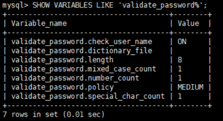

# 安装

安装MySQL5
- [CentOS7下安装mysql5.7](https://blog.csdn.net/wohiusdashi/article/details/89358071)
- [菜鸟教程中mysql安装步骤](https://www.runoob.com/mysql/mysql-install.html)，该教程中下载的rpm文件是`mysql-community-release-el7-5.noarch.rpm`，从rpm包名称中无法看出MySQL版本。**该安装步骤有问题，不能用**。

安装MySQL8
- [Centos安装MySQL8](https://www.cnblogs.com/funbin/p/11154784.html)

MySQL5和MySQL8安装主要区别是下载的rpm包不一样，导致后续安装步骤有区别，如果开始下载的是MySQL5的rpm包，就用MySQL5相关的安装步骤；如果开始下载的是MySQL8的rpm包，就用MySQL8相关的安装步骤。开始安装老是出问题，就是因为用MySQL8安装步骤来安装MySQL5，**这个坑要注意**。

**这里记录Cenos7下MySQL8的安装过程**

## 1 卸载MySQL

如果系统之前安装了MySQL5，在安装MySQL8之前需要先把MySQL5卸载干净。

1. 如果有MySQL服务，先关闭

```sh
systemctl stop mysqld 
systemctl disable mysqld
```

2. 查看已经安装的MySQL并卸载

```sh
rpm -qa | grep -i mysql
```


yum卸载

```sh
#for循环删除
for line in `rpm -qa | grep -i mysql`;do yum remove $line; done
```

3. 删除mysql目录

```sh
#查找和mysql相关的目录
find / -name mysql
```

```sh
#同理删除
for line in `find / -name mysql`;do rm -rf $line; done
```

## 2 安装MySQL8

1. 下载rpm文件

```sh
# 进入/root/download
wget https://repo.mysql.com//mysql80-community-release-el7-3.noarch.rpm
```

在Window中解压上述rpm文件会发现，包含着mysql-community.repo、mysql-community-source.repo，其实就是用yum安装MySQL时需要用到的yum源。

2. 执行上述下载下载的rpm包。

```sh
yum -y install mysql80-community-release-el7-3.noarch.rpm
```

或者`rpm -ivh mysql80-community-release-el7-3.noarch.rpm`，效果是一样的，都会在`/etc/yum.repos.d`下面生成mysql-community.repo、mysql-community-source.repo文件。

3. 安装MySQL服务器，这不可能要花点时间(最好使用[国内 yum 源](https://www.runoob.com/linux/linux-yum.html))

```sh
yum -y install mysql-community-server
```

## 3 启动数据库服务

启动MySQL数据库服务，查看服务状态

```sh
systemctl start  mysqld.service
```

```sh
systemctl status mysqld.service
```

## 4 初始化密码

1. 查看刚安装完的临时密码

```sh
grep "password" /var/log/mysqld.log
```

2. 进入数据库

```sh
mysql -u root -p
```

提示输入密码，即上述的临时密码。此时执行任何sql操作，都提示“ERROR 1820 (HY000): You must reset your password using ALTER USER statement before executing this statement.”，即需要初始化密码才能操作数据库：

`ALTER USER 'root'@'localhost' IDENTIFIED BY '新密码';`

MySQL数据库默认有密码策略，所以这里设置的密码不能太简单（密码设置时必须包含大小写字母、特殊符号、数字，并且长度大于8位）。密码重置后就可以任意执行sql命令了，如看一下默认的密码策略



- validate_password.length 密码长度的最小值
- validate_password.mixed_case_count 密码至少要包含的小写字母个数和大写字母个数，**此处表示至少要包含一个大写字母和一个小写字母**
- validate_password.number_count 密码至少要包含的数字个数
- validate_password.policy 密码的强度验证等级（0-->low  1-->MEDIUM  2-->strong）
  - LOW：只验证长度；
  - MEDIUM：验证长度、数字、大小写、特殊字符；
  - STRONG：验证长度、数字、大小写、特殊字符、字典文件；
- validate_password.special_char_count 密码至少要包含的特殊字符数

但此时还有一个问题，就是因为安装了Yum Repository，以后每次yum操作都会自动更新，需要把这个卸载掉：

```sh
yum -y remove mysql80-community-release-el7-3.noarch
```

这个操作跟安装MySQL8中的第2步是相对的，结果会删除掉`/etc/yum.repos.d`下面mysql相关yum源文件


## 5 注意

在命令行输入sql命令时，最好在语句结尾加上`;`


