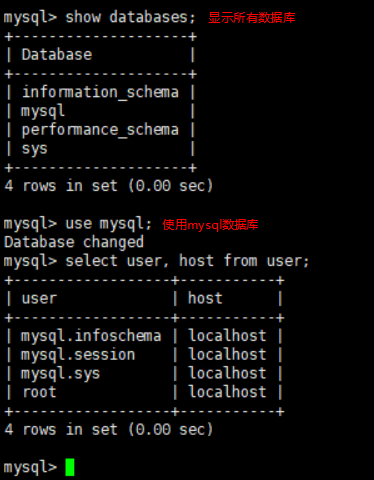
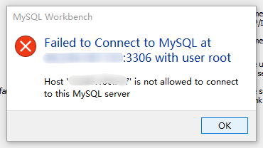
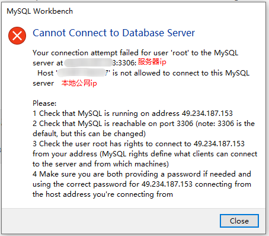
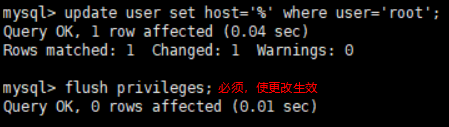
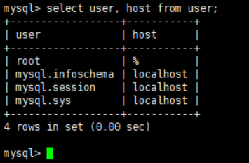

# 远程连接MySQL数据库

[CentOs7中Mysql8.0设置远程连接](https://www.cnblogs.com/lylongs/p/11048714.html)

**最好使新建一个用户，而不是用root用户来远程连接**，下面介绍如何用root来远程连接

刚安装完MySQL数据库，只能在MySQL所在的主机连接数据库，不能远程连接数据库的原因是`mysql` database下的user表root用户的host的属性值为localhost。

在Window下远程连接MySQL服务器，即使所有信息填写正确，会报如下错误

`update user set host='%' where user='root';` 注意`flush privileges;`必须。

%代表任意的客户端，可替换成具体IP地址。

查看更改之后的权限

