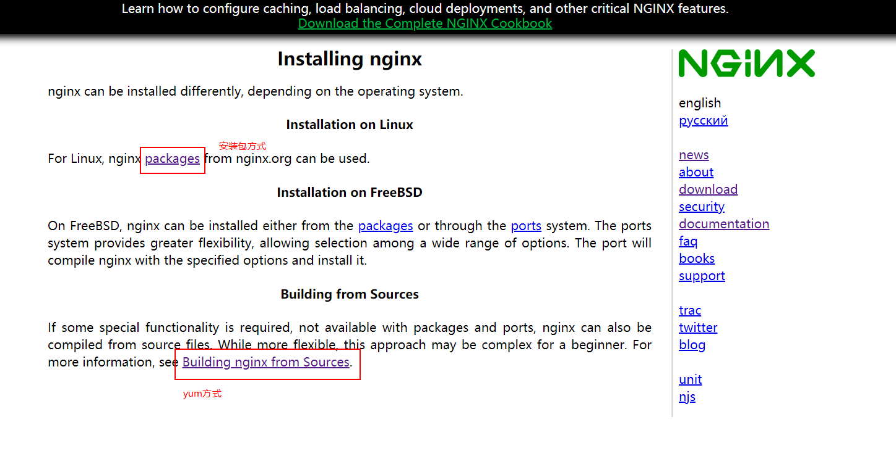
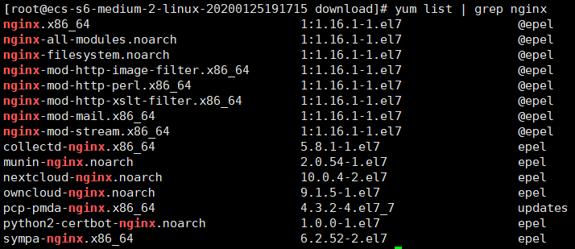

# Nginx

## 1 检查yum源

可以通过安装包的方式和yum的方式来安装Nginx，这里介绍基于Yum的方式安装Nginx。[链接](http://nginx.org/en/docs/install.html)



查看Nginx是否在可安装软件清单列表中

`yum list | grep nginx`

如果出现以下内容说明yum源是存在的。



如果当前yum源中没有Nginx，那么需要新增一个yum源

通过`vim /etc/yum.repos.d/nginx.repo`创建nginx.repo文件，内容如下：
```sh
[nginx]
name=nginx repo
baseurl=http://nginx.org/packages/centos/$releasever/$basearch/
gpgcheck=0
enabled=1
```

## 2 安装

```sh
yum install nginx
```

## 3 检验是否安装成功

```sh
nginx -v
```

