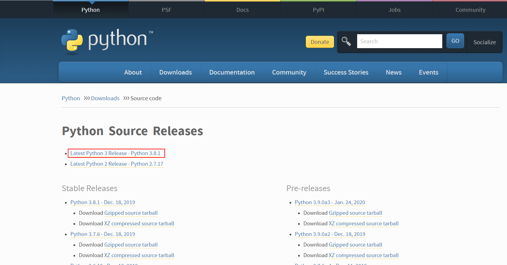
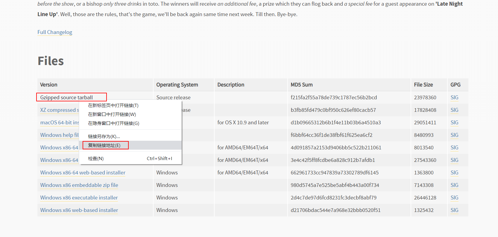

# 安装Python3.8

1. 下载源码压缩包，[地址](https://www.python.org/downloads/source/)




进入家目录/root/download，执行如下命令：

```sh
wget https://www.python.org/ftp/python/3.8.1/Python-3.8.1.tgz
```

源码是用C语言编写，因此需要Linux主机安装GCC编译器

2. 解压压缩包，会在当前目录下生成Python-3.8.1文件夹

```sh
tar -zxvf Python-3.8.1.tgz
```
3. 创建编译安装目录（一般安装在这里，这边不能省略）

```sh
mkdir /usr/local/python3
```

4. 配置

进入Python-3.8.1文件夹，指定安装路径

```sh
cd Python-3.8.1
./configure --prefix=/usr/local/python3
```

5. 安装

```sh
make
make install
```

6. 配置环境变量

修改 /etc/profile 文件

```
PATH=$PATH:/usr/local/redis-5.0.7/src
export PATH
```

执行`source /etc/profile`

7. 验证

```sh
[root@ecs-s6-medium-2-linux-20200125191715 bin]# python3 -V
Python 3.8.1
[root@ecs-s6-medium-2-linux-20200125191715 bin]# pip3 -V
pip 19.2.3 from /usr/local/python3/lib/python3.8/site-packages/pip (python 3.8)
[root@ecs-s6-medium-2-linux-20200125191715 bin]#
```

8. 修改pip源。进入主目录/root，新建.pip/pip.conf文件，内容如下：

```conf
[global]
index-url = http://mirrors.aliyun.com/pypi/simple/
[install]
trusted-host = mirrors.aliyun.com
```

9. 注意
    - Linux上可能并存Python 2.x和Python 3.x，因此对应的命令时python3、pip3。
    - 安装Python同时，也会安装Python包管理工具pip。


