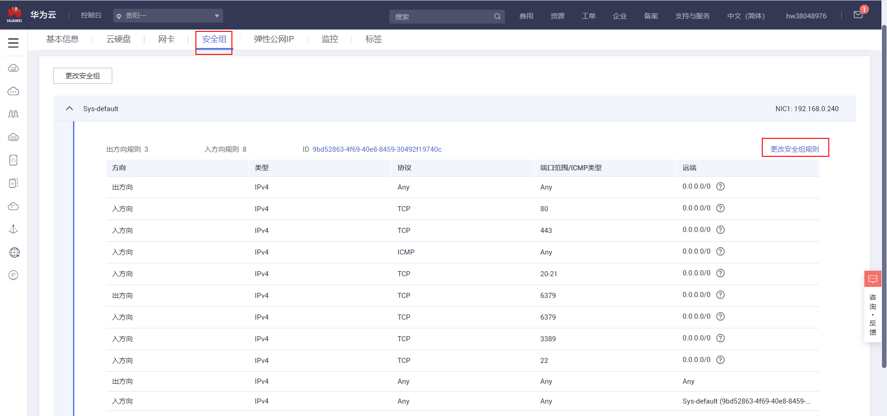
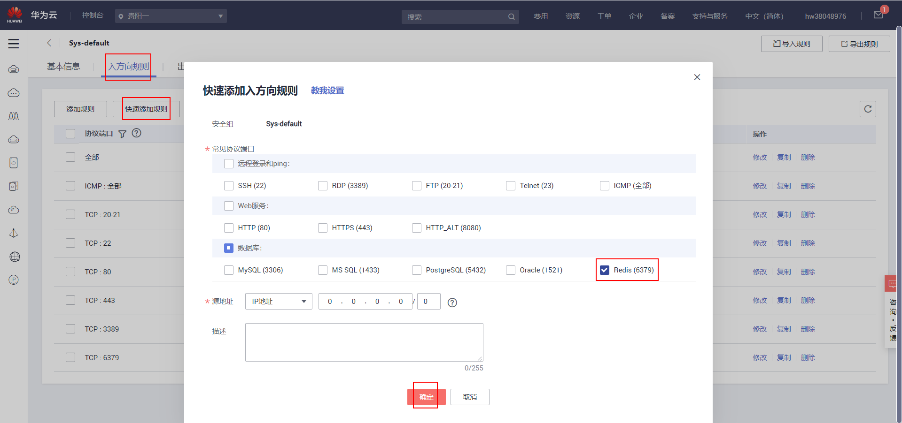
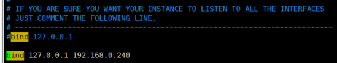
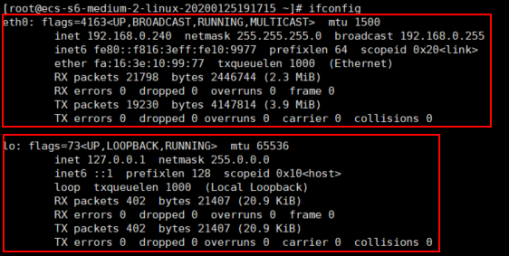
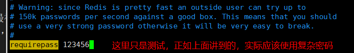
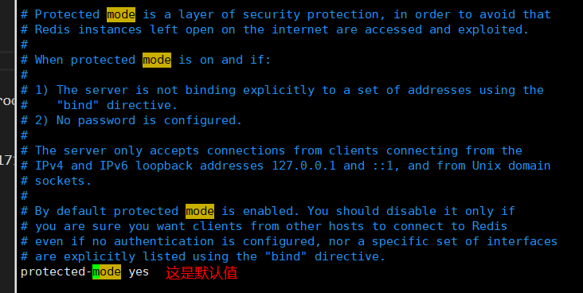
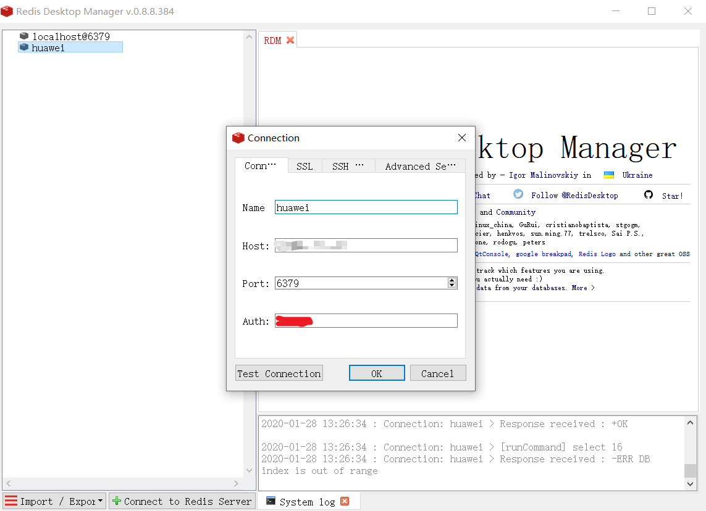

# Redis

## 1 下载源码，解压缩后编译源码

```sh
[root@ecs-s6-medium-2-linux-20200125191715 ~]# wget http://download.redis.io/releases/redis-5.0.7.tar.gz
[root@ecs-s6-medium-2-linux-20200125191715 ~]# tar xzf redis-5.0.7.tar.gz
[root@ecs-s6-medium-2-linux-20200125191715 ~]# cd redis-5.0.7
[root@ecs-s6-medium-2-linux-20200125191715 redis-5.0.7]# make
```

上面步骤说明：
- wget命令没加-P，因此在当前目录`/root`下载Redis
- 解压Redis压缩包
- 可以通过ls命令查看当前目录下有哪些目录文件，进入解压后的文件夹
- 编译，在src目录生成相关的二进制命令文件

## 2 在本地Linux服务器连接Redis服务

在本地Linux服务器连接Redis服务无需修改`/root/redis-5.0.7`目录下的redis.conf配置文件

```sh
[root@ecs-s6-medium-2-linux-20200125191715 redis-5.0.7]# cd src
[root@ecs-s6-medium-2-linux-20200125191715 src]# ./redis-server
```

注意，第二条命令一定要写成 `./redis-server`（此时使用默认配置，等价于`./redis-server ../redis.conf`），而不是 `redis-server`，运行其它二进制的程序也一样，直接写 `redis-server`，linux 系统会去 PATH 里寻找有没有叫 `redis-server` 的，而只有 /bin, /sbin, /usr/bin，/usr/sbin 等在 PATH 里，你的当前目录通常不在 PATH 里，所以写成 `redis-server` 是会找不到命令的，要用 `./redis-server` 告诉系统说，就在当前目录找。

```sh
[root@ecs-s6-medium-2-linux-20200125191715 src]# ./redis-cli
127.0.0.1:6379> set foo bar
OK
127.0.0.1:6379> get foo
"bar"
127.0.0.1:6379>
```

## 3 在其他主机（如Win10）连接Redis服务

### 3.1 配置安全组

如果使用的云主机，如华为云，需要配置安全组，开通相应的端口，只需配置**入方向**的规则




### 3.2 修改并使用Redis配置文件

在其他主机（如Win10）连接Redis服务，需要修改`/root/redis-5.0.7`目录下的redis.conf配置文件，并在执行redis-server命令时使用修改后的配置文件。否则会提示如下错误：

Response received : -DENIED Redis is running in protected mode because protected mode is enabled, no bind address was specified, no authentication password is requested to clients. In this mode connections are only accepted from the loopback interface. If you want to connect from external computers to Redis you may adopt one of the following solutions:
1) Just disable protected mode sending the command 'CONFIG SET protected-mode no' from the loopback interface by connecting to Redis from the same host the server is running, however MAKE SURE Redis is not publicly accessible from internet if you do so. Use CONFIG REWRITE to make this change permanent.
2) Alternatively you can just disable the protected mode by editing the Redis configuration file, and setting the protected mode option to 'no', and then restarting the server.
3) If you started the server manually just for testing, restart it with the '--protected-mode no' option.
4) Setup a bind address or an authentication password. NOTE: You only need to do one of the above things in order for the server to start accepting connections from the outside.

翻译如下：

收到的响应：-拒绝的Redis正在受保护模式下运行，因为已启用受保护模式，未指定绑定地址，未向客户端请求身份验证密码。在此模式下，只接受来自环回接口的连接。如果要从外部计算机连接到Redis，可以采用以下解决方案之一：
1) 只需禁用保护模式，通过从运行服务器的同一主机连接到Redis，从环回接口发送命令“CONFIG SET protected mode no”，但是，如果这样做，请确保Redis不可从internet公开访问。使用配置重写将此更改永久化。
2) 或者，您可以通过编辑Redis配置文件，将protected mode选项设置为no，然后重新启动服务器来禁用protected mode。
3) 如果您只是为了测试而手动启动服务器，请使用“--protected mode no”选项重新启动它。
4) 设置绑定地址或身份验证口令。注意：您只需要执行上述操作之一，服务器就可以开始接受来自外部的连接。

这里选择修改配置文件，设置绑定地址和身份认证密码。在redis.conf同目录下先备份一份最初的配置文件，如备份文件命名为redis.conf.bk，以防后续参考使用。配置文件改动如下：

- bind指定用于设置允许那些客户端访问Redis服务器↓



绑定127.0.0.1，可以在安装了Redis服务的本地主机连接Redis服务。

192.168.0.140是通过再服务器执行ifconfig得到的。

注意：这里应该bind的是redis所在服务器网卡的ip。也就是说，如果你的redis服务器有两张网卡，一张是ip-1,另一张是ip-2，如果你bind ip-1.那么只有请求ip-1的请求会被受理。127.0.0.1好比是卧室的门，192.168.0.240是家的大门，家可能还有后门...，打开卧室的门允许家人内部流动，打开大门、后面可以允许外面的人进入家里。



- 给Reids服务设置密码，通过ip地址和密码登录↓



- 有时候需要关注下protected-mode指令，这里没有修改它



`Ctrl + c`关闭之前的Redis服务，然后进入/root/redis-5.0.7/src目录重启Redis服务↓
```sh
[root@ecs-s6-medium-2-linux-20200125191715 src]# ./redis-server ../redis.conf
```
在win10去连接远程Redis服务↓



或者通过终端登录：`redis-cli -h xxx -p 6379 -a xxx`

关闭程序

```sh
[root@ecs-s6-medium-2-linux-20200125191715 src]# ./redis-cli
127.0.0.1:6379> auth ***
OK
127.0.0.1:6379> shutdown
not connected>
```

`auth ***` 认证，相当于登录

