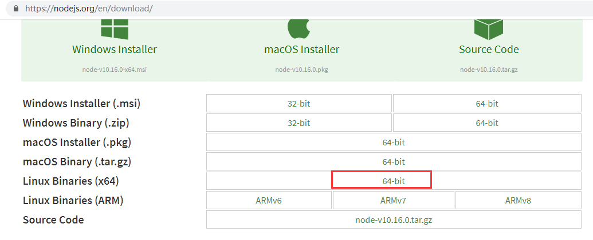

# Node

## 1 下载安装包 

进入/root/download目录，下载Node安装包`wget https://npm.taobao.org/mirrors/node/v12.16.1/node-v12.16.1-linux-x64.tar.xz`，获取下载路径↓


## 2 解压安装包

`tar -xvf node-v12.16.1-linux-x64.tar.xz`

## 3 移动并改名

将解压后的文件夹移动到/usr/local目录下，并修改目录名称

```sh
cd /usr/local/
mv /root/download/node-v12.16.1-linux-x64 . #后面的.表示移动到当前目录
mv node-v12.16.1-linux-x64/ nodejs
```

## 4 设置环境变量

编辑/etc/profile，在文件末尾增加配置

```sh
export PATH=$PATH:/usr/local/nodejs/bin
```

执行`source /etc/profile`使改动生效。

## 5 验证是否安装成功

```sh
node -v
npm -v
```

