# CentOS7使用PackageCloud安装RabbitMQ

## 1 安装erlang和rabbitmq

[参考]https://www.cnblogs.com/townsend/p/11276222.html

操作系统：CentOS 7.6 64bit

使用PackageCloud安装RabbitMQ是最简单的安装方式，按照官方文档来就可以了。

[https://www.rabbitmq.com/install-rpm.html#package-cloud](https://www.rabbitmq.com/install-rpm.html#package-cloud)

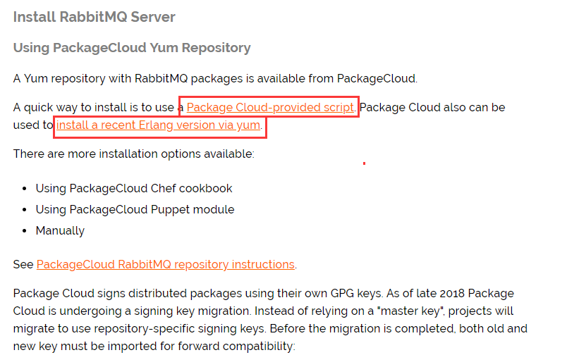

1 运行Package Cloud提供的RabbitMQ Server快速安装脚本

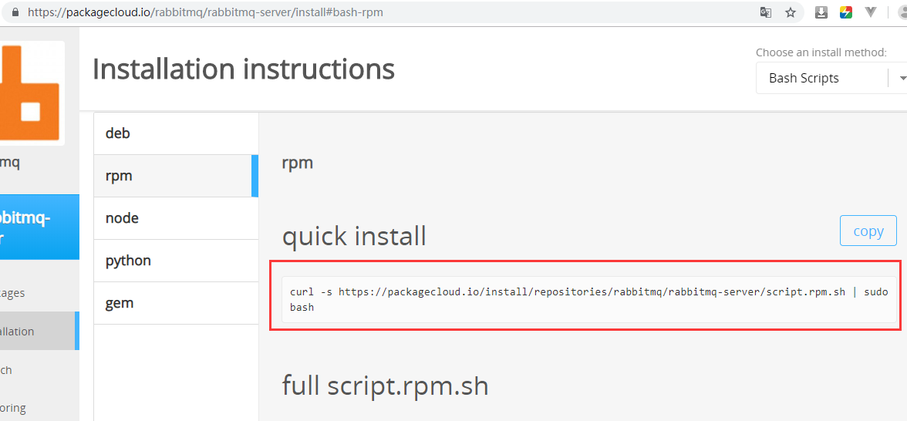

`curl -s https://packagecloud.io/install/repositories/rabbitmq/rabbitmq-server/script.rpm.sh | sudo bash`

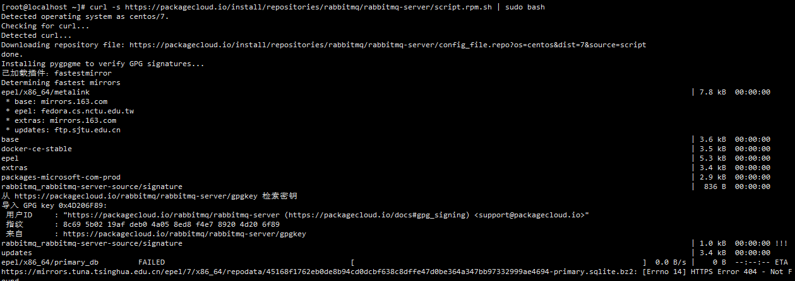

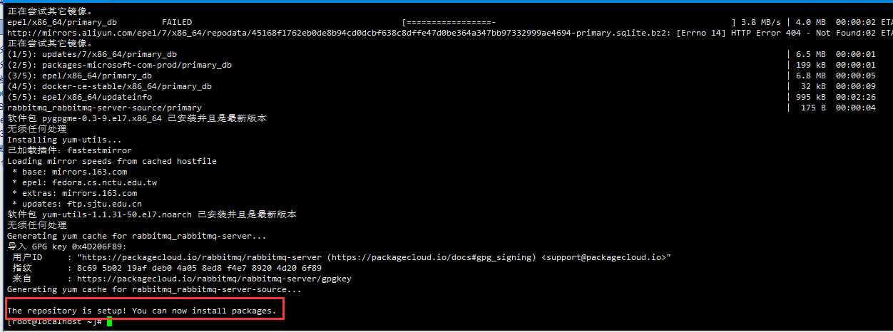

2 运行Package Cloud提供Erlang环境快速安装脚本

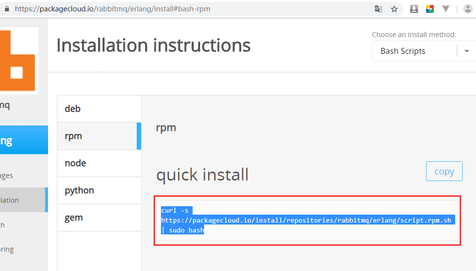

`curl -s https://packagecloud.io/install/repositories/rabbitmq/erlang/script.rpm.sh | sudo bash`

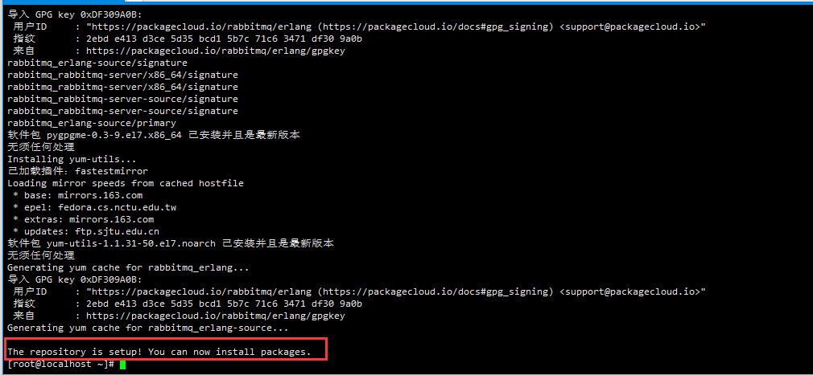

3 使用yum安装Erlang环境

`yum  -y install erlang`

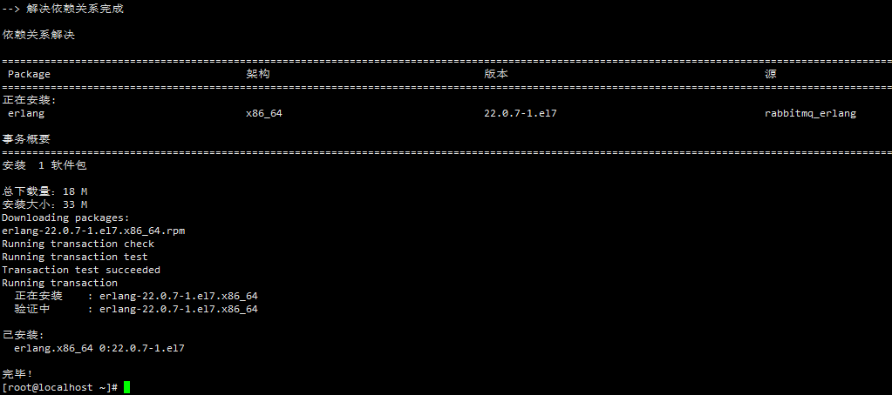

常见问题：erlang包冲突，出现如下错误提示：

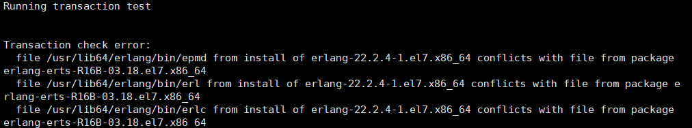

执行，`yum remove erlang-erts-R16B-03.18.el7.x86_64`，然后重新安装 erlang `yum  -y install erlang` 即可。

4 使用yum安装RabbitMQ Server

`yum -y install rabbitmq-server`

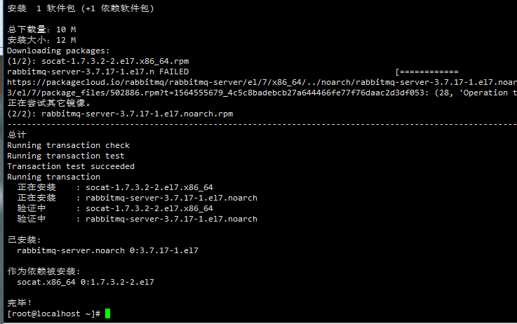

5 启动RabbitMQ服务

`systemctl start rabbitmq-server.service`

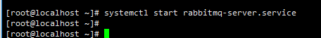

还有几条有用的命令：

- systemctl restart rabbitmq-server.service 重启服务
- systemctl stop rabbitmq-server.service 停止服务
- systemctl reload rabbitmq-server.service 重载服务
- systemctl status rabbitmq-server.service 检查服务状态

6 查看RabbitMQ服务状态

`systemctl status rabbitmq-server.service`

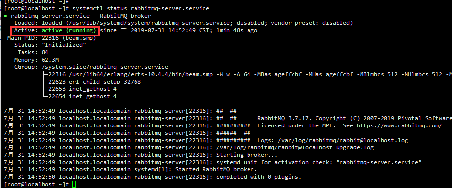

Active为running运行状态表示服务启动成功

7 安装Web管理插件

`rabbitmq-plugins enable rabbitmq_management`

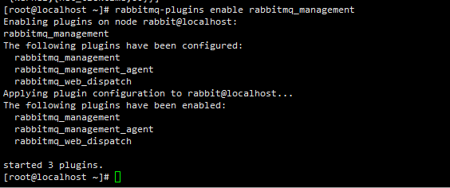

8 华为云主机安全组如方向规则添加15672端口

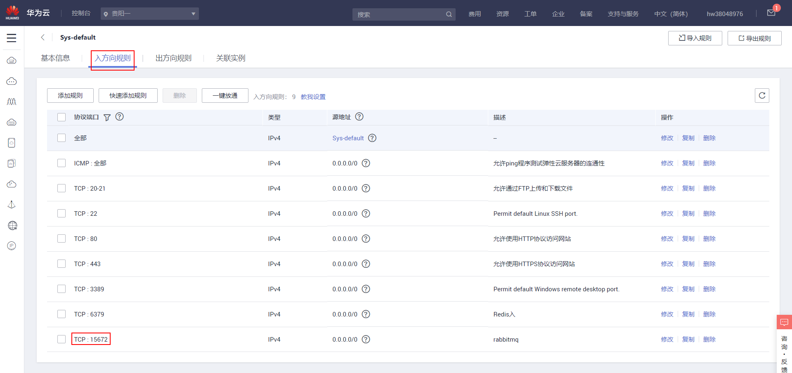

9 在win10浏览器使用15672端口打开管理网页

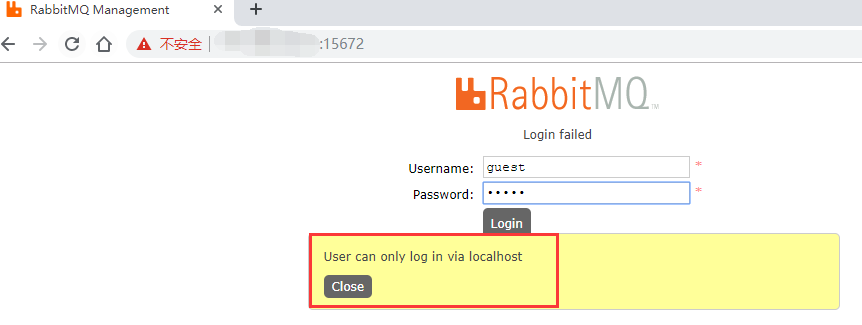

默认用户名密码都是guest，因为我不是localhost无法使用guest登录(rabbitmq从3.3.0开始禁止使用guest/guest权限通过除localhost外的访问)

9.1 使用添加新的管理员权限用户的方式登录

添加用户

`rabbitmqctl add_user username password`

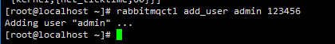

给用户设置管理员权限

`rabbitmqctl set_user_tags username administrator`

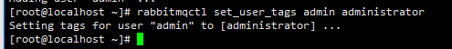

然后使用刚刚添加的用户登录管理网页

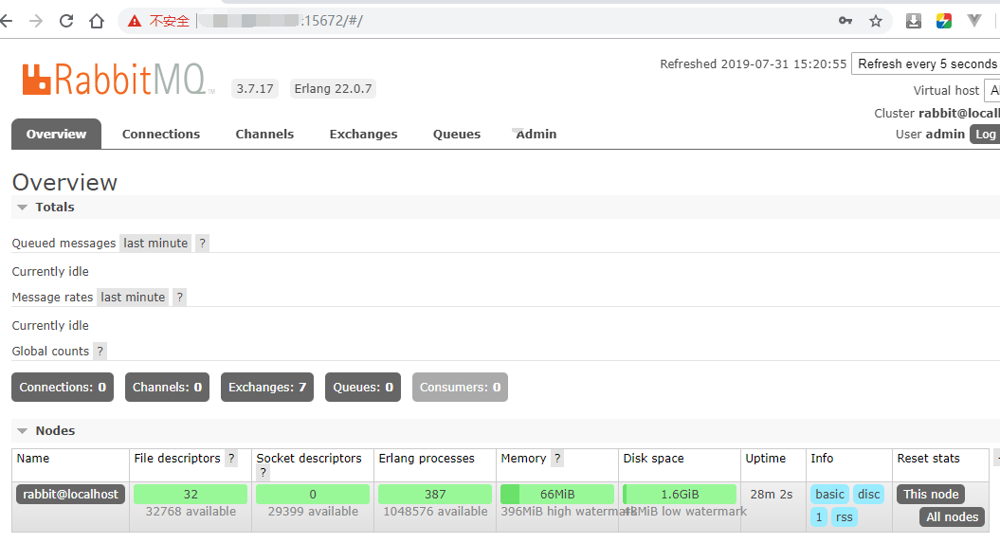

9.2 使用开启远程使用guest账号方式

在RabbitMQ Server的目录ebin文件夹下找到rabbit.app （/usr/lib/rabbitmq/lib/rabbitmq_server-3.8.2/ebin）

将loopback_users属性的数组置空，{loopback_users, [<<"guest">>]},改为{loopback_users, []}

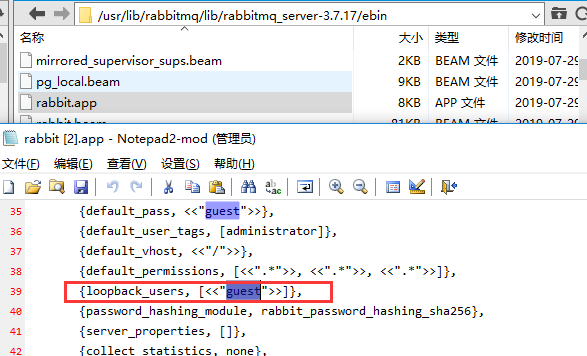

然后重启RabbitMQ服务就可以使用guest登录了，并在web管理页面中修改密码或者新建一个用户。

## 2 其他

### 2.1 程序安装位置

erlang安装目录：/usr/lib64/erlang

rabbitmq安装目录：/usr/lib/rabbitmq

### 2.2 其他命令

查看RabbitMQ状态：rabbitmqctl status

停止RabbitMQ服务：systemctl stop rabbitmq-server.service

重启RabbitMQ服务：systemctl restart rabbitmq-server.service

查看RabbitMQ用户列表：rabbitmqctl list_users

删除RabbitMQ用户：rabbitmqctl delete_user username

修改RabbitMQ用户密码：rabbitmqctl oldPassword Username newPassword

### 2.3 检查系统是否安装了erlang和rabbitmq

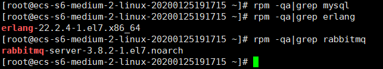

拓展：执行`rpm -qa|grep mysql`无输出，说明系统没有安装mysql

