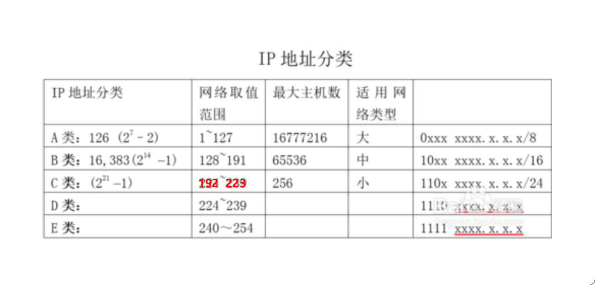

# IP地址

## IP
[参考1](https://cloud.tencent.com/info/f38b95c8a1edf8acb2f885e68f4b45e4.html)

[参考2](https://jingyan.baidu.com/article/358570f696a0ebce4724fcde.html)

[参考3](http://www.360doc.com/content/19/0325/18/11107386_824091761.shtml)

[参考4](https://baijiahao.baidu.com/s?id=1606474671793061553&wfr=spider&for=pc)

[参考5](https://www.sojson.com/convert/subnetmask.html)

[参考6](https://blog.csdn.net/gui951753/article/details/79210535)

IP地址由网络地址和主机地址组成，共32位。为了便于记忆，分为4部分，每部分8位，用十进制表示。

根据网络地址的不同分为5种类型，分别为A类地址、B类地址、C类地址、D类地址和E类地址。

A类IP地址

1字节网络地址 + 3字节主机地址，网络地址最高位必须是`0`,

B类IP地址

2字节网络地址 + 2字节主机地址，网络地址最高位必须是`10`,

C类IP地址

3字节网络地址 + 1字节主机地址，网络地址最高位必须是`110`,

D类IP地址

用于多点广播（Multicast）。 D类IP地址第一个字节以`1110`开始，它是一个专门保留的地址。它并不指向特定的网络，目前这一类地址被用在多点广播（Multicast）中。多点广播地址用来一次寻址一组计算机，它标识共享同一协议的一组计算机。224.0.0.0到239.255.255.255用于多点广播 。

E类IP地址

以`llll0`开始，为将来使用保留。240.0.0.0到255.255.255.254，255.255.255.255用于广播地址

全零（0.0.0.0）地址对应于当前主机。全“1”的IP地址（255.255.255.255）是当前子网的广播地址。

在IP地址3种主要类型里，各保留了3个区域作为私有地址，其地址范围如下：
A类地址：10.0.0.0～10.255.255.255
B类地址：172.16.0.0～172.31.255.255
C类地址：192.168.0.0～192.168.255.255

给定一个IP地址即可确定是公有地址还是私有地址，如果是私有地址，则你的设备将不可被公网访问到，简单说外面的人无法直接访问你的设备。如果想要假设服务器之类的，则需要跟供应商协商获取公网IP或者让供应商给你进行业务端口映射。

## 子网掩码

子网掩码顾名思义是用于划分子网的

192.168.0.1/24

通过192.168.0.1确定IP范围
首先看IP地址属于哪种类型的IP地址，192.168.0.1属于C类IP地址，即前3个字节192.168.0是网络地址，是固定的，后1个字节1是主机地址，是可变的，故可用IP为00000000 - 11111111，去掉首尾共254个

通过24确定子网容量
24，表示子网掩码（前面24个1，后面8个0），8个0表示该子网掩码划分出的子网容量为256（2的8次方），也就是说192.168.1.0-255都在同一个子网中，这256个地址中可用地址只有254个，因为规定每个子网的第一个IP地址为网段地址，最后一个IP地址为广播地址，都不可用。
24也表示前面3位相同（二进制就是前面24位）的地址能够在局域网下直接通信

